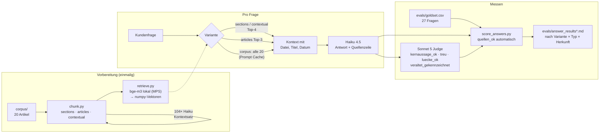

# UC3 — Context Engineering: Retrieval vs. Kontextfenster

## Kurzfassung

**Die Frage:** Ein KI-Assistent soll Kundenfragen aus der Hilfe-Doku einer App beantworten, und zwar mit Quellenangabe. Wie gibt man ihm am besten die richtigen Informationen mit? Gemessen wurden vier Wege an 27 realistischen Kundenfragen. Die Doku umfasst 20 Hilfeartikel und enthält absichtlich eingebaute Fallen, zum Beispiel eine veraltete Preisseite.

**Was dabei herauskam:**

1. **Bei einer kleinen Wissensbasis reicht der einfache Weg.** Man kann dem Assistenten die drei passendsten Artikel komplett mitgeben oder gleich alle 20. Beide Wege sind im Rahmen der Messgenauigkeit gleich gut. Sie liefern durchgehend öfter die inhaltlich richtige Antwort als die Variante, die Artikel in einzelne Absätze zerlegt. Eine aufwendige Such-Pipeline lohnt sich bei 20 Artikeln nicht.
2. **Ein bekannter Zusatztrick brachte hier nichts.** Beim sogenannten Contextual Retrieval bekommt jeder Textbaustein vorab eine KI-erzeugte Einordnung. In diesem Setup verbesserte das nichts. Ein besseres, kostenloses Suchmodell brachte einen Teil desselben Effekts ohne Mehraufwand.
3. **Die Anweisung an die KI war ein größerer Hebel als die Architektur.** Ein präziserer Prompt hob die beste Variante von 19 auf 23 von 27 vollständig richtigen Antworten. Außerdem gilt: Mehr Material ist nicht gratis. Je mehr Text die KI sieht, desto eher erfindet sie Verbindungen zwischen Quellen, die so nirgends stehen.
4. **Veraltete Inhalte sind ein Redaktionsproblem, kein Technikproblem.** Eine alte, nicht gekennzeichnete Preisseite wurde bei passenden Fragen öfter gefunden als die aktuelle. Die billigste Lösung ist, alte Seiten zu löschen oder sichtbar als veraltet zu markieren.
5. **Kosten: rund 3 USD pro 1000 Anfragen.** Wer alle Artikel mitschickt, braucht Zwischenspeicherung (Caching). Ohne sie kosten 1000 Anfragen 14,34 USD, mit ihr 2,61 USD. Wie viel davon ankommt, hängt davon ab, wie dicht die Anfragen eintreffen.

**Wie belastbar ist das?** Bei 27 Fragen liegt die Messunsicherheit bei etwa ±15 Prozentpunkten. Unterschiede von 3–4 Fragen sind deshalb Tendenzen, keine Beweise. Die Richtung der Ergebnisse ist aber über mehrere Messungen hinweg stimmig.

---

## Problem

Die Hilfe-Doku der fiktiven Habit-Tracker-App **FocusFlow** (20 deutsche Artikel, je etwa 200–260 Wörter, zusammen etwa 12,5k Tokens) soll die Grundlage für einen Support-Assistenten sein. Er beantwortet Kundenfragen ausschließlich aus dieser Doku und nennt die Quelle.

Die zentrale Frage des Context Engineering ist: **Welchen Kontext bekommt das Modell pro Frage?** Verglichen werden:

1. **Klassisches Chunking:** Die Artikel werden an Überschriften in Abschnitte zerlegt, die Top-k Abschnitte werden per Embedding-Suche gefunden.
2. **Contextual Retrieval:** wie 1, aber jeder Abschnitt bekommt vor dem Embedding einen LLM-erzeugten Kontextsatz zum Gesamtartikel ([Anthropic](https://www.anthropic.com/news/contextual-retrieval)).
3. **Ganze Artikel:** Die Top-3 Artikel werden komplett übergeben.
4. **Ganzer Korpus im Kontextfenster:** kein Retrieval, alle 20 Artikel im Prompt, mit Prompt Caching.

Der Korpus enthält vier absichtlich eingebaute Fallen, die in echten Wikis typisch sind:
- eine **veraltete Preisseite** (2024, andere Preise, 7-Tage-Testphase), nicht als veraltet markiert
- **bewusste Lücken**, zum Beispiel Teamlizenzen, App-Sprachen und Rechnungen mit USt-ID
- **Mehrquellen-Fragen**, die sich nur mit zwei Artikeln zusammen beantworten lassen
- **ähnlich klingende Artikel mit gegenteiliger Aussage** („Abo kündigen“ und „Konto löschen“)

Details dazu stehen in [docs/CORPUS_NOTES.md](docs/CORPUS_NOTES.md).

Adressat ist, wer entscheiden muss, wie viel Architektur ein Support-Assistent über einer kleinen Wissensbasis braucht.

## PM-Entscheidung

**Ein kontrollierter Korpus statt echter Doku.** Die Fallen sind bekannt, deshalb lässt sich messen, ob ein Ansatz an ihnen scheitert. Echte Doku hätte die Fehlerursachen verdeckt.

**Retrieval und Antwort werden getrennt gemessen.** Zuerst lief nur das Retrieval (Recall@k, lokal und ohne API-Kosten), erst danach die Antwortstufe. Sonst hätte man nicht unterscheiden können, ob eine falsche Antwort am Finden oder am Formulieren liegt.

**Lokale Embeddings, mehrsprachig.** Sie kosten nichts, keine Daten verlassen den Rechner, und das Vorgehen lässt sich nachvollziehen. Geplant war `multilingual-e5-base`, `bge-m3` lief als kostenlose Gegenprobe mit. Nachdem die Gegenprobe fast überall gewonnen hatte, bin ich auf bge-m3 gewechselt.

**Vier getrennte Bewertungsspalten statt eines Gesamturteils:**
- `quellen_ok`: automatisch aus der Quellenzeile
- `kernaussage_ok`: Judge vergleicht mit der Goldset-Aussage
- `treu`: Judge prüft, ob jede Behauptung durch den mitgegebenen Kontext gedeckt ist (Faithfulness)
- `luecke_ok`: nur Support-Verweis, keine erfundene Antwort

Erst durch diese Trennung wurde der Zielkonflikt zwischen Vollständigkeit und Faithfulness sichtbar.

**Antwortmodell Haiku 4.5, Judge Sonnet 5.** Haiku wurde gewählt, damit die Kosten mit UC1 und UC2 vergleichbar sind. Der Judge ist ein anderes Modell als das bewertete, damit Haiku nicht seine eigenen Antworten benotet. Der Judge wurde an einer Stichprobe von Hand kalibriert.

**Bewusst weggelassen:**
- feste Chunk-Fenster mit Überlappung: Die Doku ist durch Überschriften strukturiert, die Artikel sind kurz.
- Vektor-Datenbank: numpy reicht für 104 Vektoren.
- LangChain und LlamaIndex: Der Code läuft direkt gegen das SDK.

Alle Entscheidungen stehen datiert in [docs/decisions.md](docs/decisions.md).

## Architekturskizze



Die Skripte sind einfach gehalten, jede Stufe schreibt Dateien, die die nächste liest:

| Skript | Aufgabe | API-Kosten |
|---|---|---|
| `load_corpus.py` | Artikel parsen (Titel, Datum, Abschnitte), Goldset laden | – |
| `chunk.py` | drei Chunk-Varianten, Kontextsätze mit Haiku (gecacht in `data/contexts.json`) | einmalig 0,14 USD |
| `retrieve.py` | Embeddings (lokal, gecacht) und Cosinus-Suche | – |
| `eval_retrieval.py` | Recall@1/3/5 für 2 Modelle × 3 Varianten | – |
| `run_answers.py [v1\|v2]` | Antworten je Variante | Haiku |
| `judge_answers.py [v1\|v2]` | Judge-Urteile mit Structured Output | Sonnet 5 |
| `score_answers.py [v1\|v2]` | Auswertung, Vergleich v1/v2, Judge-Stichprobe | – |

## Evaluationsergebnisse

### Retrieval (Recall@3 über Chunks, 23 Fragen mit Quelle)

| Embedding | sections (Baseline) | articles | contextual |
|---|---|---|---|
| multilingual-e5-base | 0.70 | 0.78 | 0.83 |
| **bge-m3** | 0.78 | **1.00** | 0.83 |

- Contextual Retrieval bringt bei e5 +3 Fragen, bei bge-m3 nur +1. Das stärkere Modell übernimmt also einen Teil des Effekts, ohne dafür API-Aufrufe zu brauchen.
- Bei `articles` ist Top-3 aus 20 Artikeln schon 15 % des Korpus und liefert etwa 720 Wörter Kontext. Ein Teil des Vorsprungs ist deshalb einfach mehr Text.
- Die **veraltete Preisseite** rankt bei den Fragen, die ihre Begriffe benutzen („4,99“, „7 Tage testen“), fast immer vor der aktuellen. Das Retrieval kann diese Falle nicht lösen.
- Details: [evals/retrieval_results.md](evals/retrieval_results.md)

### Antworten: Lauf v1 (27 Fragen je Variante)

`alles_ok` bedeutet, dass alle zutreffenden Spalten ok sind.

| Variante | quellen_ok | kernaussage_ok | treu | luecke_ok | **alles_ok** |
|---|---|---|---|---|---|
| sections (Top-4 Abschnitte) | 22/27 | 17/23 | 24/27 | 4/4 | **19/27** |
| contextual (Top-4 mit Kontextsatz) | 21/27 | 15/23 | 25/27 | 3/4 | **17/27** |
| articles (Top-3 Artikel) | 26/27 | 21/23 | 21/27 | 4/4 | **19/27** |
| corpus (alle 20, Cache) | 27/27 | 21/23 | 21/27 | 4/4 | **20/27** |

- **Mehr Kontext bringt bessere Inhalte, aber schlechtere Faithfulness.** Bei den Mehrquellen-Fragen kommt corpus auf 3/4, sections auf 1/4. Mit viel Kontext schmückt Haiku dagegen häufiger aus, etwa mit „Drittländer wie die USA“ oder „vielleicht ein veralteter Browser-Cache“.
- **Contextual schadet in der Antwortstufe.** Die generischen Kontextsätze ziehen bei Preisfragen die alte Seite nach vorn. Haiku sieht dann nur sie und antwortet „Ja, 7 Tage Testphase!“.

### Antworten: Lauf v2, geschärfter Prompt (nur articles und corpus)

Geändert wurde nur der Antwort-Prompt:
- knapp antworten
- keine Aussagen, die nicht im Kontext stehen, auch keine naheliegenden Folgerungen oder Beispiele
- sachlicher Ton ohne Emojis und Floskeln
- bei Widerspruch die neuere Quelle nennen und die ältere als veraltet kennzeichnen

| Variante | alles_ok v1 → v2 | treu v1 → v2 | kernaussage_ok v1 → v2 | Ø Wörter |
|---|---|---|---|---|
| articles | 19 → **23**/27 | 21 → 25 | 21 → 21 | 93 → 70 |
| corpus | 20 → 20/27 | 21 → 21 | 21 → 19 | 101 → 74 |

- **Bei articles wirkt der Prompt:** 4 von 6 Faithfulness-Verstößen sind weg, die Antworten etwa 25 % kürzer. Das ist der beste Wert aller Varianten.
- **Bei corpus verschieben sich die Fehler nur.** „Knapp“ kostet Vollständigkeit bei Mehrquellen-Fragen. Außerdem entstehen neue Erfindungen, die Widersprüche mit ausgedachten Regeln auflösen, etwa „Testphase nur im App Store“.
- Details: [evals/answer_results.md](evals/answer_results.md) (v1) und [evals/answer_results_v2.md](evals/answer_results_v2.md) (v2 mit Vergleich je Frage)

### Die Fallen im Ergebnis

| Falle | Befund |
|---|---|
| Veraltete Preisseite | Das Retrieval bevorzugt die alte Seite. Mit Datum im Kontext und der Regel „neuere Quelle gilt“ antwortet Haiku meist richtig und legt den Widerspruch offen. Wenn nur die alte Seite im Kontext landet (contextual), hilft keine Regel. |
| Lücken | 4/4 in fast allen Varianten. Haiku verweist sauber an den Support. Zwei Ausreißer bei derselben Frage (Datenimport): Einmal liefert Haiku verwandte Informationen als Teilantwort mit (contextual v1), einmal erfindet es die Negativaussage „keine Importfunktion“ (corpus v2). |
| Mehrquellen | Die Schwachstelle der Abschnitt-Varianten (1/4). Ganze Artikel oder der ganze Korpus liefern beide Teile eher mit. |
| Ähnliche Artikel | Inhaltlich werden Abo kündigen und Konto löschen fast immer korrekt auseinandergehalten (`kernaussage_ok` 15 von 16). Die Fehler dort sind Ausschmückungen (`treu`), vor allem bei „Konto versehentlich gelöscht“ (#21), wo Haiku tröstende, aber nicht gedeckte Hinweise ergänzt. |

### Judge-Kalibrierung

Ich habe 10 zufällige Urteile von Sonnet 5 von Hand geprüft (Seed 42, gestreut über Varianten, Typen und Kriterien) und stimme **10 von 10** zu. Ein Fall ist ein Grenzfall, weil die Kernaussage zwei Aussagen ohne gekennzeichnete Pflichtaussage enthielt. Die Übereinstimmung liegt damit bei 9–10/10, der Judge gilt als kalibriert ([evals/judge_stichprobe.md](evals/judge_stichprobe.md)).

**Arbeitsteilung Mensch/Claude:** Ich habe die Methode entschieden, also Kriterien, Scoring-Regeln und Varianten, und die Judge-Kriterien abgenommen. Claude hat die Domänenfakten des fiktiven Unternehmens gegen den Korpus geprüft. Dabei fiel eine Überinterpretation in einer Goldset-Erwartung auf (#18), die korrigiert wurde.

## Kosten & Latenz

**Pflichtzahlen für die empfohlene Variante `articles` v2** (Top-3 ganze Artikel, geschärfter Prompt):

| Kennzahl | Wert |
|---|---|
| **Kosten pro 1000 Anfragen** | **3,29 USD** (Haiku 4.5, gemessen aus `usage`; Retrieval lokal und kostenlos) |
| **p95-Latenz** | **4,50 s** (Median 2,62 s; davon Retrieval etwa 0,1 s) |
| **Qualität** | **23/27 = 85 % alles_ok** (95-%-Konfidenzintervall etwa ±13 Prozentpunkte) |

Alle Varianten im Vergleich:

| Variante | Kosten / 1000 | Median | p95 |
|---|---|---|---|
| sections v1 | 2,00 USD | 2,67 s | 3,48 s |
| contextual v1 | 2,48 USD (+ einmalig 0,14 USD Indexierung) | 2,80 s | 3,69 s |
| articles v1 / **v2** | 3,45 / **3,29 USD** | 3,19 / **2,62 s** | 4,59 / **4,50 s** |
| corpus v1 / v2 | 3,17 / 2,87 USD | 3,46 / 3,29 s | 5,32 / 6,35 s |

**Caching ist der Kostenhebel beim ganzen Korpus.** Ohne Cache kosten 1000 Anfragen 14,34 USD, bei durchgehend warmem Cache 2,61 USD (Lauf v1; v2: 14,14 → 2,31 USD). Ein Cache-Eintrag hält 5 Minuten. Bei dünnem Traffic wird der Cache häufiger neu geschrieben, und der Vorteil schrumpft. Wie stark das bei realen Traffic-Mustern wirkt, ist **Input für UC8**.

Die Experimente haben insgesamt 2,92 USD gekostet: Kontextsätze 0,14, Lauf v1 mit Judge und Neu-Scoring 1,85, Lauf v2 mit Judge 0,93 USD. Der Judge macht davon etwa 80 % aus.

## Grenzen

- **Kleine Stichprobe:** Bei n=27 und einer Trefferquote um 80 % ergibt das Binomial-Konfidenzintervall (95 %) etwa **±15 Prozentpunkte**, also rund ±4 Fragen. Unterschiede von 3–4 Fragen, auch 19 → 23 in v2, liegen innerhalb dieser Spanne. Die Kernaussagen stützen sich deshalb auf Richtungen, die sich über Retrieval, v1 und v2 hinweg wiederholen, nicht auf einzelne Differenzen. In den Typ-Spalten (n=3–12) sind die Zahlen nur anekdotisch.
- **Einzelläufe:** Je Stand gibt es einen Lauf, Wiederholungen wurden bewusst nicht gemacht. Haiku ist trotz temperature 0 nicht deterministisch.
- **17 von 27 Goldset-Erwartungen hat Claude entworfen.** Sie wurden nur maschinell gegen den Korpus geprüft, nicht von mir abgenommen. Als Gegenmaßnahme sind alle Metriken nach Herkunft aufgeschlüsselt. Dabei zeigte sich kein systematischer Unterschied, allerdings bei n=5 je menschlicher Gruppe.
- **Scoring-Regel nach dem Lauf angepasst:** `quellen_ok` bei veralteten Seiten erlaubt jetzt ein Zitat der alten Seite, wenn die Antwort sie als veraltet kennzeichnet. Die strenge Regel hatte das gewünschte transparente Verhalten bestraft. Die Zahlen vor und nach der Änderung stehen in [docs/decisions.md](docs/decisions.md).
- **Künstlicher Korpus:** 20 kurze, sauber strukturierte Artikel. Bei Hunderten von Artikeln oder unstrukturierter Doku kann das Ergebnis zugunsten von Retrieval kippen.
- **Ein Judge-Modell:** Kalibriert wurde an 10 von rund 340 Urteilen.

## Learnings

- **Erst die Korpusgröße anschauen, dann die Architektur wählen.** Bei etwa 12k Tokens passt alles ins Kontextfenster, und Caching macht das bezahlbar. Die RAG-Pipeline musste sich gegen „alles mitschicken“ erst beweisen, und das gelang ihr nicht.
- **Die Stufen getrennt messen.** Die Retrieval-Eval hat gezeigt, dass die Veraltet-Falle nicht am Finden scheitert, sondern am Umgang mit dem Gefundenen. Ohne die Trennung wäre das eine Vermutung geblieben.
- **Die Gegenprobe ist billig und aufschlussreich.** Das zweite Embedding-Modell hat nichts gekostet und die ursprüngliche Wahl umgeworfen.
- **Kriterien getrennt ausweisen.** Ein Gesamtscore hätte articles v1 und sections v1 als gleich gut gezeigt (je 19/27). Getrennt sieht man, dass die eine Variante an Faithfulness scheitert, die andere an Inhalten.
- **Der Prompt schlägt die Architektur,** aber nicht überall: Dieselbe Prompt-Änderung half bei 3 Artikeln und verschob die Fehler bei 20. Prompt und Kontextmenge müssen zusammen getestet werden.
- **Content-Qualität vor Modell-Qualität.** Die veraltete Seite ist mit einem Löschvorgang behoben. Kein Retrieval-Trick hat sie zuverlässig neutralisiert.
- **Regeländerungen nach dem Lauf offenlegen.** Eine Regel, die nach dem Blick auf die Ergebnisse geändert wird, ist legitim, aber nur mit beiden Zahlenständen daneben.

## Was ich anders machen würde

- **Pro Goldset-Frage genau eine Pflichtaussage.** Mehrteilige Kernaussagen machen `kernaussage_ok` zur Ermessensfrage. Der einzige Grenzfall der Judge-Kalibrierung kam genau daher.
- **Die Kosten pro Experiment vorab abschätzen und nennen,** einschließlich Judge. Der Judge war mit etwa 80 % der größte Posten, das war vorher nicht offensichtlich. Dasselbe gilt für lokale Downloads: Die Embedding-Modelle belegen etwa 5 GB.
- Das Goldset größer anlegen oder von vornherein mit Wiederholungsläufen planen, damit Unterschiede von 3–4 Fragen belastbar werden.
- Contextual Retrieval erst testen, wenn der Korpus zu groß für das Kontextfenster ist. Bei 20 Artikeln war die Frage absehbar akademisch.

## Benutzung

```bash
python3 -m venv .venv && .venv/bin/pip install -r requirements.txt
echo "ANTHROPIC_API_KEY=..." > .env      # gitignored

.venv/bin/python chunk.py                 # Chunks + Kontextsätze (aus Cache: kostenlos)
.venv/bin/python eval_retrieval.py        # Retrieval-Eval, lokal (lädt beim ersten Mal ~5 GB Modelle)
.venv/bin/python run_answers.py v2        # Antworten (überspringt bereits vorhandene)
.venv/bin/python judge_answers.py v2      # Judge (überspringt bereits vorhandene)
.venv/bin/python score_answers.py v2      # Auswertung ohne API-Kosten, beliebig oft
```

Alle Rohdaten liegen im Repo (`data/*.jsonl`). Die Auswertung lässt sich ohne API-Aufrufe reproduzieren. Python 3.9, sentence-transformers 5.1, anthropic 0.125, lauffähig auf einem Apple M5 mit 16 GB.
