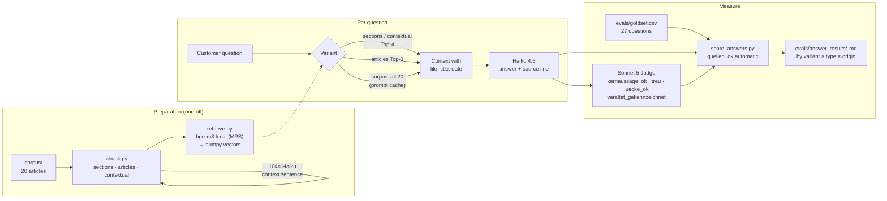

🇩🇪 [Deutsche Version](README_DE.md)

# UC3 — Context Engineering: Retrieval vs. Context Window

## Summary

**The question:** An AI assistant is meant to answer customer questions from an app's help documentation, with a source citation. What is the best way to give it the right information? Four approaches were measured on 27 realistic customer questions. The documentation consists of 20 help articles and contains deliberately built-in traps, for example an outdated pricing page.

**What came out of it:**

1. **With a small knowledge base, the simple approach is enough.** You can give the assistant the three best-matching articles in full, or simply all 20. Within the measurement precision, both approaches are equally good. They consistently deliver the correct content more often than the variant that splits articles into individual sections. An elaborate search pipeline does not pay off with 20 articles.
2. **A well-known add-on technique did not help here.** In so-called Contextual Retrieval, every text chunk gets an AI-generated contextual description up front. In this setup it improved nothing. A better, free search model delivered part of the same effect without extra effort.
3. **The instruction to the AI was a bigger lever than the architecture.** A more precise prompt raised the best variant from 19 to 23 out of 27 fully correct answers. Also: more material is not free. The more text the AI sees, the more likely it is to invent connections between sources that are not stated anywhere.
4. **Outdated content is an editorial problem, not a technical one.** An old, unmarked pricing page was retrieved more often than the current one for matching questions. The cheapest fix is to delete old pages or visibly mark them as outdated.
5. **Cost: about 3 USD per 1000 requests.** Sending all articles requires caching. Without it, 1000 requests cost 14.34 USD; with it, 2.61 USD. How much of that saving is realized depends on how densely the requests arrive.

**How robust is this?** With 27 questions, the measurement uncertainty is about ±15 percentage points. Differences of 3–4 questions are therefore tendencies, not proof. The direction of the results is, however, consistent across several measurements.

---

## Problem

The help documentation of the fictional habit-tracker app **FocusFlow** (20 German articles, each about 200–260 words, about 12.5k tokens in total) is meant to be the basis for a support assistant. It answers customer questions exclusively from this documentation and names the source.

The central question of context engineering is: **Which context does the model get per question?** Compared are:

1. **Classic chunking:** The articles are split into sections at headings; the top-k sections are found via embedding search.
2. **Contextual Retrieval:** as in 1, but before embedding, each section gets an LLM-generated context sentence about the whole article ([Anthropic](https://www.anthropic.com/news/contextual-retrieval)).
3. **Whole articles:** The top-3 articles are passed in full.
4. **Whole corpus in the context window:** no retrieval, all 20 articles in the prompt, with prompt caching.

The corpus contains four deliberately built-in traps that are typical of real wikis:
- an **outdated pricing page** (2024, different prices, 7-day trial), not marked as outdated
- **deliberate gaps**, for example team licenses, app languages and invoices with a VAT ID
- **multi-source questions** that can only be answered by combining two articles
- **similar-sounding articles with opposite statements** ("Abo kündigen" (cancel subscription) and "Konto löschen" (delete account))

Details are in [docs/CORPUS_NOTES.md](docs/CORPUS_NOTES.md).

The intended reader is anyone who has to decide how much architecture a support assistant over a small knowledge base needs.

## PM Decision

**A controlled corpus instead of real documentation.** The traps are known, so it is possible to measure whether an approach fails on them. Real documentation would have obscured the causes of errors.

**Retrieval and answering are measured separately.** First only retrieval was run (Recall@k, local and without API costs), and only then the answer stage. Otherwise it would have been impossible to tell whether a wrong answer was caused by finding or by formulating.

**Local, multilingual embeddings.** They cost nothing, no data leaves the machine, and the process is traceable. The plan was `multilingual-e5-base`; `bge-m3` ran alongside as a free cross-check. After the cross-check won almost everywhere, I switched to bge-m3.

**Four separate scoring columns instead of one overall verdict:**
- `quellen_ok`: automatically from the source line
- `kernaussage_ok`: judge compares against the Goldset statement
- `treu`: judge checks whether every claim is covered by the provided context (faithfulness)
- `luecke_ok`: only a referral to support, no invented answer

Only this separation made the trade-off between completeness and faithfulness visible.

**Answer model Haiku 4.5, judge Sonnet 5.** Haiku was chosen so that costs are comparable with UC1 and UC2. The judge is a different model from the one being evaluated, so that Haiku does not grade its own answers. The judge was calibrated by hand on a sample.

**Deliberately left out:**
- fixed chunk windows with overlap: the documentation is structured by headings, and the articles are short.
- vector database: numpy is enough for 104 vectors.
- LangChain and LlamaIndex: the code runs directly against the SDK.

All decisions are recorded with dates in [docs/decisions.md](docs/decisions.md).

## Architecture Sketch


```mermaid
flowchart LR
    subgraph V["Preparation (one-off)"]
        C["corpus/<br/>20 articles"] --> CH["chunk.py<br/>sections · articles · contextual"]
        CH -- "104× Haiku<br/>context sentence" --> CH
        CH --> E["retrieve.py<br/>bge-m3 local (MPS)<br/>→ numpy vectors"]
    end
    subgraph P["Per question"]
        Q["Customer question"] --> R{"Variant"}
        R -- "sections / contextual<br/>Top-4" --> K["Context with<br/>file, title, date"]
        R -- "articles Top-3" --> K
        R -- "corpus: all 20<br/>(prompt cache)" --> K
        E -.-> R
        K --> H["Haiku 4.5<br/>answer + source line"]
    end
    subgraph M["Measure"]
        G["evals/goldset.csv<br/>27 questions"] --> S
        H --> S["score_answers.py<br/>quellen_ok automatic"]
        H --> J["Sonnet 5 Judge<br/>kernaussage_ok · treu · luecke_ok<br/>veraltet_gekennzeichnet"]
        J --> S
        S --> O["evals/answer_results*.md<br/>by variant × type × origin"]
    end
```

The scripts are kept simple; each stage writes files that the next one reads:

| Script | Task | API cost |
|---|---|---|
| `load_corpus.py` | parse articles (title, date, sections), load Goldset | – |
| `chunk.py` | three chunk variants, context sentences with Haiku (cached in `data/contexts.json`) | one-time 0.14 USD |
| `retrieve.py` | embeddings (local, cached) and cosine search | – |
| `eval_retrieval.py` | Recall@1/3/5 for 2 models × 3 variants | – |
| `run_answers.py [v1\|v2]` | answers per variant | Haiku |
| `judge_answers.py [v1\|v2]` | judge verdicts with structured output | Sonnet 5 |
| `score_answers.py [v1\|v2]` | scoring, v1/v2 comparison, judge sample | – |

## Evaluation Results

### Retrieval (Recall@3 over chunks, 23 questions with a source)

| Embedding | sections (baseline) | articles | contextual |
|---|---|---|---|
| multilingual-e5-base | 0.70 | 0.78 | 0.83 |
| **bge-m3** | 0.78 | **1.00** | 0.83 |

- Contextual Retrieval adds +3 questions with e5, but only +1 with bge-m3. The stronger model therefore takes over part of the effect without needing any API calls.
- With `articles`, the top 3 out of 20 articles already make up 15% of the corpus and provide about 720 words of context. Part of the lead is therefore simply more text.
- The **outdated pricing page** almost always ranks ahead of the current one for questions that use its terms ("4,99", "7 Tage testen" (7-day trial)). Retrieval cannot solve this trap.
- Details: [evals/retrieval_results.md](evals/retrieval_results.md)

### Answers: run v1 (27 questions per variant)

`alles_ok` means that all applicable columns are ok.

| Variant | quellen_ok | kernaussage_ok | treu | luecke_ok | **alles_ok** |
|---|---|---|---|---|---|
| sections (top-4 sections) | 22/27 | 17/23 | 24/27 | 4/4 | **19/27** |
| contextual (top-4 with context sentence) | 21/27 | 15/23 | 25/27 | 3/4 | **17/27** |
| articles (top-3 articles) | 26/27 | 21/23 | 21/27 | 4/4 | **19/27** |
| corpus (all 20, cache) | 27/27 | 21/23 | 21/27 | 4/4 | **20/27** |

- **More context yields better content but worse faithfulness.** On the multi-source questions, corpus reaches 3/4, sections 1/4. With a lot of context, however, Haiku embellishes more often, for example with "Drittländer wie die USA" (third countries such as the USA) or "vielleicht ein veralteter Browser-Cache" (perhaps an outdated browser cache).
- **Contextual hurts in the answer stage.** For pricing questions, the generic context sentences pull the old page to the top. Haiku then sees only that page and answers "Ja, 7 Tage Testphase!" (Yes, 7-day trial!).

### Answers: run v2, sharpened prompt (articles and corpus only)

Only the answer prompt was changed:
- answer concisely
- no statements that are not in the context, including no obvious inferences or examples
- factual tone without emojis or filler phrases
- in case of a contradiction, name the newer source and mark the older one as outdated

| Variant | alles_ok v1 → v2 | treu v1 → v2 | kernaussage_ok v1 → v2 | Avg. words |
|---|---|---|---|---|
| articles | 19 → **23**/27 | 21 → 25 | 21 → 21 | 93 → 70 |
| corpus | 20 → 20/27 | 21 → 21 | 21 → 19 | 101 → 74 |

- **With articles, the prompt works:** 4 of 6 faithfulness violations are gone, and the answers are about 25% shorter. This is the best result of all variants.
- **With corpus, the errors merely shift.** "Knapp" (concise) costs completeness on multi-source questions. In addition, new inventions appear that resolve contradictions with made-up rules, for example "Testphase nur im App Store" (trial only in the App Store).
- Details: [evals/answer_results.md](evals/answer_results.md) (v1) and [evals/answer_results_v2.md](evals/answer_results_v2.md) (v2 with per-question comparison)

### The traps in the results

| Trap | Finding |
|---|---|
| Outdated pricing page | Retrieval prefers the old page. With the date in the context and the rule "neuere Quelle gilt" (the newer source applies), Haiku usually answers correctly and discloses the contradiction. If only the old page ends up in the context (contextual), no rule helps. |
| Gaps | 4/4 in almost all variants. Haiku cleanly refers to support. Two outliers on the same question (data import): once Haiku includes related information as a partial answer (contextual v1), once it invents the negative statement "keine Importfunktion" (no import function) (corpus v2). |
| Multi-source | The weak spot of the section variants (1/4). Whole articles or the whole corpus are more likely to deliver both parts. |
| Similar articles | In terms of content, cancelling a subscription and deleting an account are almost always kept apart correctly (`kernaussage_ok` 15 of 16). The errors there are embellishments (`treu`), especially for "Konto versehentlich gelöscht" (account accidentally deleted) (#21), where Haiku adds reassuring but unsupported hints. |

### Judge calibration

I checked 10 random verdicts from Sonnet 5 by hand (seed 42, spread across variants, types and criteria) and agree with **10 of 10**. One case is borderline, because the core statement contained two statements without a marked mandatory statement. Agreement is therefore 9–10/10, and the judge is considered calibrated ([evals/judge_stichprobe.md](evals/judge_stichprobe.md)).

**Division of work between human and Claude:** I decided the method, i.e. criteria, scoring rules and variants, and signed off on the judge criteria. Claude checked the domain facts of the fictional company against the corpus. This surfaced an over-interpretation in one Goldset expectation (#18), which was corrected.

## Cost & Latency

**Required figures for the recommended variant `articles` v2** (top-3 whole articles, sharpened prompt):

| Metric | Value |
|---|---|
| **Cost per 1000 requests** | **3.29 USD** (Haiku 4.5, measured from `usage`; retrieval local and free) |
| **p95 latency** | **4.50 s** (median 2.62 s; of which retrieval about 0.1 s) |
| **Quality** | **23/27 = 85% alles_ok** (95% confidence interval about ±13 percentage points) |

All variants compared:

| Variant | Cost / 1000 | Median | p95 |
|---|---|---|---|
| sections v1 | 2.01 USD | 2.67 s | 3.48 s |
| contextual v1 | 2.48 USD (+ one-time 0.14 USD indexing) | 2.80 s | 3.69 s |
| articles v1 / **v2** | 3.45 / **3.29 USD** | 3.19 / **2.62 s** | 4.59 / **4.50 s** |
| corpus v1 / v2 | 3.17 / 2.87 USD | 3.46 / 3.29 s | 5.32 / 6.35 s |

**Caching is the cost lever for the whole corpus.** Without a cache, 1000 requests cost 14.34 USD; with a consistently warm cache, 2.61 USD (run v1; v2: 14.14 → 2.31 USD). A cache entry lasts 5 minutes. With sparse traffic, the cache is rewritten more often and the advantage shrinks. How strongly this plays out under real traffic patterns is **input for UC8**.

The experiments cost 2.92 USD in total: context sentences 0.14, run v1 with judge and re-scoring 1.85, run v2 with judge 0.93 USD. The judge accounts for about 80% of that.

## Limitations

- **Small sample:** With n=27 and a hit rate around 80%, the binomial confidence interval (95%) is about **±15 percentage points**, i.e. roughly ±4 questions. Differences of 3–4 questions, including 19 → 23 in v2, lie within this range. The key findings therefore rest on directions that repeat across retrieval, v1 and v2, not on individual differences. In the type columns (n=3–12), the numbers are only anecdotal.
- **Single runs:** There is one run per version; repetitions were deliberately not done. Haiku is not deterministic despite temperature 0.
- **Claude drafted 17 of 27 Goldset expectations.** They were only checked mechanically against the corpus, not signed off by me. As a countermeasure, all metrics are broken down by origin. This showed no systematic difference, though with n=5 per human group.
- **Scoring rule adjusted after the run:** `quellen_ok` for outdated pages now allows citing the old page if the answer marks it as outdated. The strict rule had penalized the desired transparent behavior. The numbers before and after the change are in [docs/decisions.md](docs/decisions.md).
- **Artificial corpus:** 20 short, cleanly structured articles. With hundreds of articles or unstructured documentation, the result may tip in favor of retrieval.
- **One judge model:** Calibration was done on 10 of about 340 verdicts.
- **Later finding (MPS bug in the old stack):** torch 2.8 computed a wrong query embedding on the Apple GPU for question #7 (gap "Mengenrabatte" (volume discounts)). Recall is not affected. However, the gap results for #7 in the retrieval variants (4 answers) are rather optimistic, because the context was wrong. Details in [docs/decisions.md](docs/decisions.md). Since the upgrade to Python 3.13 and torch 2.14, GPU and CPU compute identically. **Re-measured on 2026-09-23 with the new stack, result:** All four answers to #7 (sections, contextual and articles v1, articles v2) still pass `luecke_ok` and `treu`, even though the context now contains the pricing-related articles, and for sections and contextual even the outdated pricing page. The quality tables remain unchanged. The replaced rows are in `data/superseded_q7.jsonl`. Not re-measured is the retrieval table "Top-1-Ähnlichkeit der Lücken-Fragen" (top-1 similarity of the gap questions) in `evals/retrieval_results.md`, which does not feed into the README.

## Learnings

- **Look at the corpus size first, then choose the architecture.** At about 12k tokens, everything fits into the context window, and caching makes that affordable. The RAG pipeline first had to prove itself against "send everything", and it did not manage to.
- **Measure the stages separately.** The retrieval eval showed that the outdated-page trap does not fail at finding, but at handling what was found. Without the separation, that would have remained a guess.
- **The cross-check is cheap and revealing.** The second embedding model cost nothing and overturned the original choice.
- **Report criteria separately.** An overall score would have shown articles v1 and sections v1 as equally good (19/27 each). Separately, you can see that one variant fails on faithfulness and the other on content.
- **The prompt beats the architecture,** but not everywhere: the same prompt change helped with 3 articles and shifted the errors with 20. Prompt and context size have to be tested together.
- **Content quality before model quality.** The outdated page is fixed with a single deletion. No retrieval trick reliably neutralized it.
- **Disclose rule changes made after the run.** A rule changed after looking at the results is legitimate, but only with both sets of numbers next to it.

## What I Would Do Differently

- **Exactly one mandatory statement per Goldset question.** Multi-part core statements turn `kernaussage_ok` into a judgment call. The only borderline case in the judge calibration came from exactly this.
- **Estimate and state the cost per experiment up front,** including the judge. At about 80%, the judge was the largest item, which was not obvious beforehand. The same applies to local downloads: the embedding models take up about 5 GB.
- Make the Goldset larger or plan repeated runs from the start, so that differences of 3–4 questions become robust.
- Test Contextual Retrieval only once the corpus is too large for the context window. With 20 articles, the question was predictably academic.

## Usage

```bash
uv venv && uv pip install -r requirements.txt   # Python version from .python-version (3.13)
echo "ANTHROPIC_API_KEY=..." > .env              # gitignored

.venv/bin/python chunk.py                 # chunks + context sentences (from cache: free)
.venv/bin/python eval_retrieval.py        # retrieval eval, local (downloads ~5 GB of models on first run)
.venv/bin/python run_answers.py v2        # answers (skips existing ones)
.venv/bin/python judge_answers.py v2      # judge (skips existing ones)
.venv/bin/python score_answers.py v2      # scoring without API costs, can be rerun any time
```

All raw data is in the repo (`data/*.jsonl`). The scoring can be reproduced without API calls. The measurements ran on Python 3.9 with sentence-transformers 5.1 and anthropic 0.125. Since 2026-09-23, the repo runs on Python 3.13 with sentence-transformers 6.1 and anthropic 1.8 (Apple M5, 16 GB).
